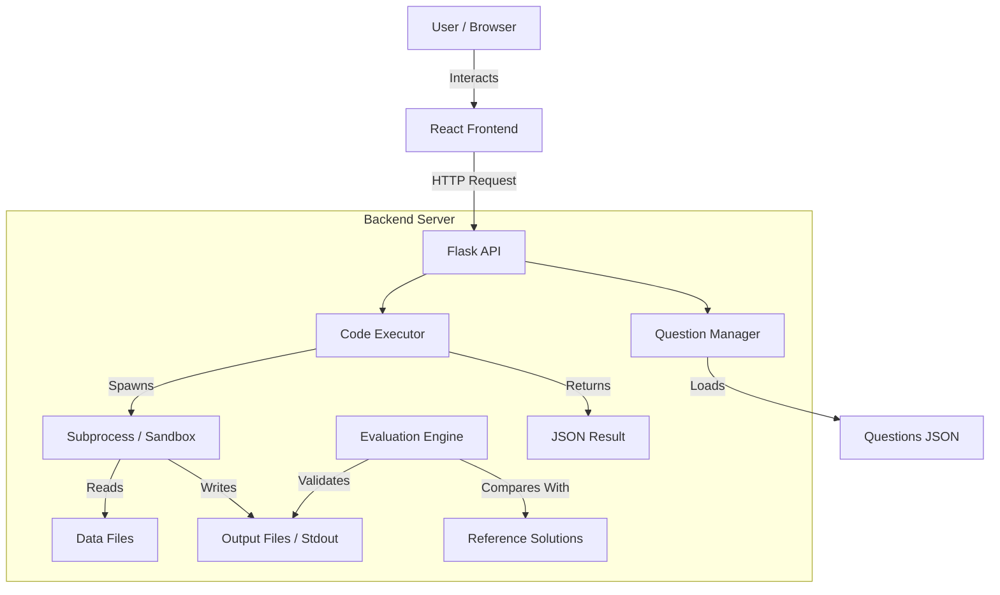
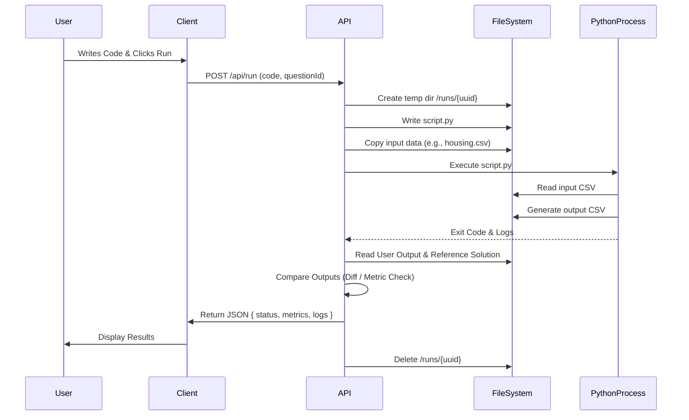

# ML Compiler & Evaluation System

A full-stack application designed to serve coding problems, execute user-submitted machine learning/data science code in a sandboxed environment, and automatically evaluate the results against reference solutions.

## 📂 Folder Structure

```
ml_compiler/
├── client/                 # Frontend React Application (Vite + Tailwind)
│   ├── public/             # Static assets
│   ├── src/                # Source code
│   │   ├── components/     # UI components (Code Editor, Results, etc.)
│   │   ├── App.jsx         # Main Application Component
│   │   └── main.jsx        # React Entry Point
│   ├── package.json        # Frontend dependencies
│   └── vite.config.js      # Vite build configuration
│
├── server/                 # Backend Flask Application
│   ├── app.py              # Main API entry point & execution logic
│   ├── data/               # Raw datasets used in questions (e.g., CSVs)
│   ├── questions/          # JSON configurations for coding problems
│   ├── solutions/          # Reference solution scripts/files
│   ├── runs/               # Temporary execution directories (GitIgnored)
│   └── requirements.txt    # Python dependencies
│
└── README.md               # Project documentation
```

## 🏗 Architecture

The system follows a **Client-Server** architecture with an isolated **Execution Engine** for running user code.



### Components
1.  **Frontend (Client)**: Built with React and Vite. It features a code editor (Monaco/CodeMirror), problem description panel, and real-time feedback display.
2.  **Backend API (Server)**: A Flask server exposing endpoints for retrieving questions and submitting code.
3.  **Execution Engine**: Handles secure execution of user code. It creates temporary directories (`server/runs/`) for each submission to prevent file conflicts.
4.  **Evaluator**: A modular system to validate user solutions.
    *   **CSV Comparison**: Validates data structure and content against a known good solution.
    *   **ML Metrics**: Evaluating regression models (MSE, R² Score) by dynamically importing user functions.

## 🔄 System Flow

1.  **Question Loading**:
    *   The server scans `server/questions/*.json` on startup.
    *   The client requests a question via `GET /api/questions/:id`.
2.  **Code Submission**:
    *   User writes code in the browser and clicks "Run".
    *   The client sends a `POST /api/run` request with the code and question ID.
3.  **Execution**:
    *   Server generates a unique run ID (UUID) and creates a directory `server/runs/<uuid>`.
    *   User code is saved as `script.py`.
    *   Required datasets are copied from `server/data/` to the run directory.
    *   `script.py` is executed in a subprocess.
4.  **Evaluation**:
    *   **If Script Success**: The Evaluator module is triggered.
    *   It checks the output files (e.g., `output.csv`) or return values against `server/solutions/`.
5.  **Response**:
    *   The server cleans up the temporary directory.
    *   It returns execution logs (stdout/stderr) and pass/fail status to the client.

## 💾 Data Flow

This sequence describes the lifecycle of a single code submission.



## 🔐 Security & Secrets Management

**CRITICAL**: Do not expose sensitive keys (API keys, database credentials) in your code repository.

1.  **Process Isolation**: The current implementation runs code on the host server. For production, **Docker containers** or **KVM microVMs** (like Firecracker) must be used to strictly sandbox code execution.
2.  **Environment Variables**:
    *   Use `.env` files to store configuration secrets.
    *   Ensure `.env` is added to your `.gitignore` file.
    *   Example: `FLASK_SECRET_KEY=your-secret-key`
3.  **Dataset Privacy**: Ensure datasets in `server/data/` do not contain PII (Personally Identifiable Information). Use anonymized or synthetic data for testing.
4.  **Input sanitization**: Validate all inputs on the server side to prevent command injection attacks, although the primary defense remains strong sandboxing.

## 🛠 Extending the Project

### Adding a New Question
1.  **Add Data**: Place any necessary CSV/Excel files in `server/data/`.
2.  **Create Solution**: Add the reference solution output or script in `server/solutions/`.
3.  **Define Question**: Create a new JSON file in `server/questions/` (e.g., `q_4_clustering.json`):
    ```json
    {
        "id": "4",
        "title": "Customer Clustering",
        "description": "Perform K-Means clustering...",
        "test_type": "csv_comparison",
        "expected_output_file": "solution_4.csv",
        "data_file": "customers.csv"
    }
    ```

## 🚀 Getting Started

### Prerequisites
*   Node.js (v16+)
*   Python (v3.9+)

### Installation

1.  **Clone the repository**
    ```bash
    git clone <your-repo-url>
    cd ml_compiler
    ```

2.  **Setup Server**
    ```bash
    cd server
    # It is recommended to use a virtual environment
    python -m venv venv
    # Windows: venv\Scripts\activate
    # Linux/Mac: source venv/bin/activate
    pip install -r requirements.txt
    python app.py
    ```

3.  **Setup Client**
    ```bash
    cd client
    npm install
    npm run dev
    ```
